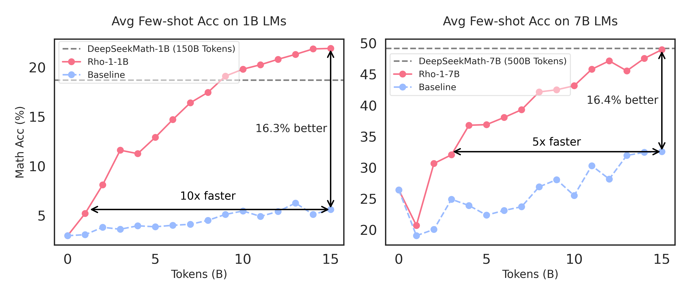
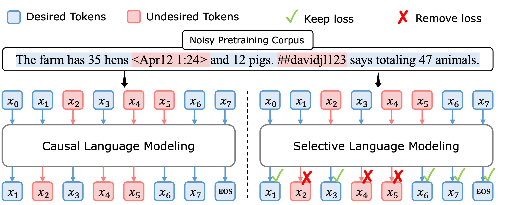
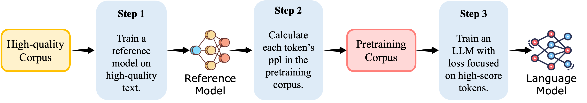

<h1 align="center">

<br>
Rho-1: Not All Tokens Are What You Need
</h1>

<div align="center">


</div>

<p align="center">
  <a href="https://arxiv.org/abs/2404.07965"><b>[📜 Arxiv]</b></a> •
  <a href="https://huggingface.co/papers/2404.07965"><b>[💬 HF Paper]</b></a> •
  <a href="https://huggingface.co/microsoft/rho-math-1b-v0.1"><b>[🤗 Models]</b></a> •
  <a href="https://github.com/microsoft/rho"><b>[🐱 GitHub]</b></a>
  <!-- <a href="https://twitter.com/zebgou/status/1778676535404396697"><b>[🐦 Twitter]</b></a> • -->
  <!-- <a href="https://huggingface.co/spaces/zubingou/rho-1"><b>[🤖 Gradio Demo]</b></a> -->
</p>

<p align="center">
    
        <br>
    <em>Figure 1: Rho-1 is pre-trained with Selective Language Modeling (SLM). SLM improves average few-shot accuracy on GSM8k and MATH by over 16%, achieving the baseline performance 5-10x faster.</em>
</p>


## 🔥 News

<!-- - [2024/04/14] 🚀🚀🚀 We release [Gradio demo of Rho-1 Code Interpreter](https://huggingface.co/spaces/zubingou/rho-1), try it out! -->
- [2024/04/12] 🔥🔥🔥 Rho-Math-v0.1 models released at 🤗 HuggingFace! 
    - [Rho-Math-1B](https://huggingface.co/microsoft/rho-math-1b-v0.1) and [Rho-Math-7B](https://huggingface.co/microsoft/rho-math-7b-v0.1) achieve 15.6% and 31.0% few-shot accuracy on MATH dataset, respectively — matching DeepSeekMath with only 3\% of the pretraining tokens.
    - [Rho-Math-1B-Interpreter](https://huggingface.co/microsoft/rho-math-1b-interpreter-v0.1) is the first 1B LLM that achieves over 40% accuracy on MATH.
    - [Rho-Math-7B-Interpreter](https://huggingface.co/microsoft/rho-math-7b-interpreter-v0.1) achieves 52% on MATH dataset, using only 69k samples for fine-tuning.
- [2024/04/11] Rho-1 paper and repo released.


## 💡 Introduction

Rho-1 base models employ Selective Language Modeling (SLM) for pretraining, which selectively trains on clean and useful tokens that aligned with the desired distribution.


### Selective Language Modeling (SLM)

<p align="center">
    
        <br>
    <em>Figure 2:
    <b>Upper:</b> Even an extensively filtered pretraining corpus contains token-level noise.
    <b>Left:</b> Previous Causal Language Modeling (CLM) trains on all tokens.
    <b>Right:</b> Our proposed Selective Language Modeling (SLM) selectively applies loss on those useful and clean tokens.</em>
</p>

<p align="center">
    
        <br>
    <em>Figure 3: <b>The pipeline of Selective Language Modeling.</b>
    SLM optimizes language model performance by concentrating on valuable, clean tokens during pre-training.
    It involves three steps:
    (Step 1) Initially, train a reference model on high-quality data.
    (Step 2) Then, score each token's loss in a corpus using the reference model.
    (Step 3) Finally, train the language model selectively on tokens that show higher excess loss compared to the reference loss.</em>
</p>

<!-- results: -->

### Evaluation Results

Base models (Few-shot CoT):

|     **Model**     | **Size** | **Data** | **Uniq. Token** | **Train Token** | **GSM8K** | **MATH** | **MMLU STEM** |  **SAT** |
|:-----------------:|:--------:|:--------:|:---------------:|:---------------:|:---------:|:--------:|:-------------:|:--------:|
| 1-2B Base Models  |          |          |                 |                 |           |          |               |          |
| Qwen1.5           | 1.8B     | -        | -               | -               | 36.1      | 6.8      | 31.3          | 40.6     |
| Gemma             | 2.0B     | -        | -               | -               | 18.8      | 11.4     | **34.4**      | 50.0     |
| DeepSeekMath      | 1.3B     | -        | 120B            | 150B            | 23.8      | 13.6     | 33.1          | **56.3** |
| [Rho-Math-1B-v0.1](https://huggingface.co/microsoft/rho-math-1b-v0.1)  | 1.1B     | OWM      | 14B             | 30B             | **36.2**  | **15.6** | 23.3          | 28.1     |
| >= 7B Base Models |          |          |                 |                 |           |          |               |          |
| Mistral           | 7B       |          | -               | -               | 41.2      | 11.6     | 49.5          | 59.4     |
| Minerva           | 540B     | -        | 39B             | 26B             | 58.8      | 33.6     | **63.9**      | -        |
| LLemma            | 34B      | PPile    | 55B             | 50B             | 54.2      | 23.0     | 54.7          | 68.8     |
| InternLM2-Math    | 20B      | -        | 31B             | 125B            | 65.4      | 30.0     | 53.1          | 71.9     |
| DeepSeekMath      | 7B       | -        | 120B            | 500B            | 64.1      | **34.2** | 56.4          | **84.4** |
| [Rho-Math-7B-v0.1](https://huggingface.co/microsoft/rho-math-7b-v0.1)  | 7B       | OWM      | 14B             | 10.5B           | **66.9**  | 31.0     | 54.6          | **84.4** |


[Tool-integrated reasoning](https://github.com/microsoft/ToRA) (Code Interpreter):

| **Model**                    | **Size** | **SFT Data** | **GSM8k** | **MATH** | **SVAMP** | **ASDiv** | **MAWPS** | **TabMWP** | **GSM-Hard** | **AVG**  |
|------------------------------|----------|--------------|-----------|----------|-----------|-----------|-----------|------------|--------------|----------|
| gpt4-early (pal)             | -        | -            | 94.2      | 51.8     | 94.8      | 92.6      | 97.7      | 95.9       | 77.6         | 86.4     |
| gpt-4-turbo-2024-04-09 (cot) | - | - | - | 73.4 | - | - | - | - | - |
| Open-Source Small Models | | | | | | | | | |
| MAmmoTH                      | 70B      | MI-260k      | 76.9      | 41.8     | 82.4      | -         | -         | -          | -            | -        |
| ToRA                         | 7B       | ToRA-69k     | 68.8      | 40.1     | 68.2      | 73.9      | 88.8      | 42.4       | 54.6         | 62.4     |
| ToRA                         | 70B      | ToRA-69k     | 84.3      | 49.7     | **82.7**  | 86.8      | 93.8      | 74.0       | **67.2**     | **76.9** |
| DeepSeekMath                 | 7B       | ToRA-69k     | 79.8      | **52.0** | 80.1      | **87.1**  | 93.8      | **85.8**   | 63.1         | 77.4     |
| [Rho-Math-1B-Interpreter-v0.1](https://huggingface.co/microsoft/rho-math-1b-interpreter-v0.1) | 1B       | ToRA-69k     | 59.4      | 40.6     | 60.7      | 74.2      | 88.6      | 26.7       | 48.1         | 56.9     |
| [Rho-Math-7B-Interpreter-v0.1](https://huggingface.co/microsoft/rho-math-7b-interpreter-v0.1) | 7B       | ToRA-69k     | 81.3      | **51.8** | 80.8      | 85.5      | **94.5**  | 70.1       | 63.1         | 75.3     |


## 🚀 Quick Start


### Evaluation

```sh
cd rho-1/math-evaluation-harness
```

Base model few-shot evaluation:

```sh
bash scripts/run_eval.sh cot microsoft/rho-math-7b-v0.1
```

SFT model (code-interpreter) evaluation:

```sh
bash scripts/run_eval.sh tora microsoft/rho-math-7b-interpreter-v0.1
```

Our reproduced outputs are provided in `rho-1/outputs.zip`.


## 🍀 Contributing

This project welcomes contributions and suggestions.  Most contributions require you to agree to a
Contributor License Agreement (CLA) declaring that you have the right to, and actually do, grant us
the rights to use your contribution. For details, visit https://cla.opensource.microsoft.com.


## ☕️ Citation

If you find this repository helpful, please consider citing our paper:

```
@misc{lin2024rho1,
      title={Rho-1: Not All Tokens Are What You Need}, 
      author={Zhenghao Lin and Zhibin Gou and Yeyun Gong and Xiao Liu and Yelong Shen and Ruochen Xu and Chen Lin and Yujiu Yang and Jian Jiao and Nan Duan and Weizhu Chen},
      year={2024},
      eprint={2404.07965},
      archivePrefix={arXiv},
      primaryClass={cs.CL}
}
```


## 🌟 Star History

[](https://star-history.com/#microsoft/rho&Date)
